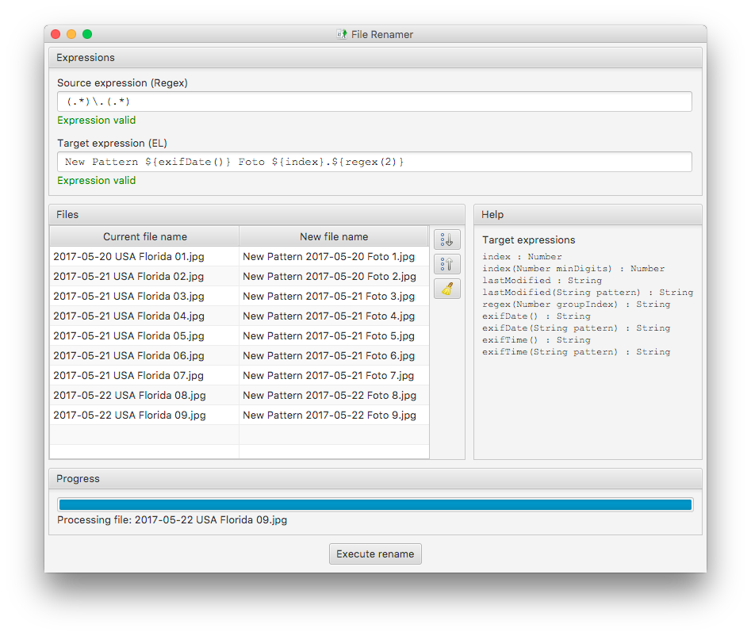

# File Renamer

Small application to easily rename files into a common pattern.

## Building the application

### Generic build

The application is written in pure Java, using a JavaFX frontend. It's therefore platform independent and can be built and run on every platform supporting a Java SDK.

For building it simply checkout the repository from GitHub and call the Maven package target on the command line:

    $ git clone https://github.com/perdian/filerenamer.git
    $ cd filerenamer
    $ mvn clean package
    $ java -jar target/filerenamer.jar

### macOS build

On macOS a simplified build that directly generated a DMG archive from which the application can be installed or distributed can be built using the following commands:

    $ git clone https://github.com/perdian/filerenamer.git
    $ cd filerenamer
    $ mvn clean package -Pmacos-bundle
    $ open target/File\ Renamer.dmg

## Authors

- [**Christian Seifert**](http://www.perdian.de)

## License

This project is licensed under the Apache 2.0 License - see the [LICENSE](LICENSE) file for details.
